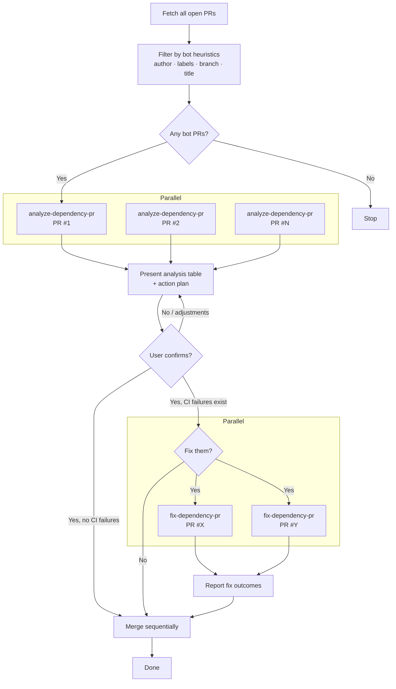

# handle-dependency-prs Workflow

Triage, fix, and merge open dependency bot PRs with minimal manual effort.

## Diagram

## Steps

### 1. Fetch & Filter
Fetches all open PRs and identifies dependency bot PRs using heuristics: author login (`renovate`, `dependabot`, etc.), author type `Bot`, labels (`dependencies`), branch prefix (`dependabot/`, `renovate/`), and title patterns (`bump X from Y to Z`). Works with any Renovate or Dependabot installation, including custom bot names.

### 2. Analyse (Parallel)
Dispatches one `maintenance:analyze-dependency-pr` agent per PR. Each agent independently fetches CI status, diff, and changed files, then assigns a safety tier:

| Tier | Label | When |
|------|-------|------|
| 1 | Very Safe | Patch, lockfile-only |
| 2 | Safe | Patch, manifest/config only |
| 3 | Likely Safe | Minor version, dependency files only |
| 4 | Review Recommended | Minor version touching source, or CI failing |
| 5 | Caution | Major version, workflow changes, or conflicts |

### 3. Present & Confirm
Presents a grouped table and a proposed action plan. Waits for explicit user confirmation before proceeding.

### 4. Fix Failing PRs (Parallel, optional)
If any PRs have CI failures, dispatches one `maintenance:fix-dependency-pr` agent per PR. Each agent creates an isolated git worktree, diagnoses the failure, and iterates fixes (up to 3 attempts). Agents run in parallel.

### 5. Merge
Merges eligible PRs sequentially in the recommended order (safest first). Approves if permitted, checks mergeability before each merge.
