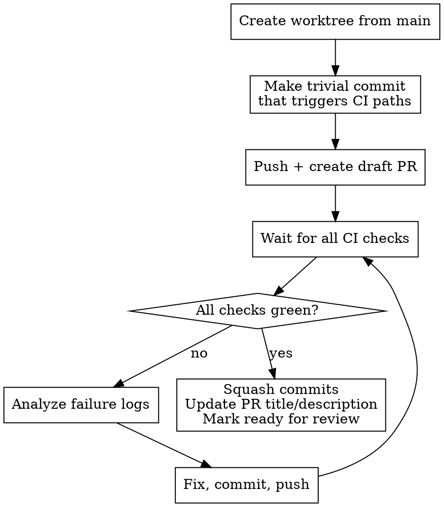

# Fix CI on Main

Create an isolated worktree from main, trigger CI via a draft PR, analyze failures, fix them, and iterate until green.

## Workflow

### 1. Create Worktree

Fetch the latest `main` (`git fetch origin main`) and use the `superpowers:using-git-worktrees` skill to create an isolated workspace based on `origin/main`.

### 2. Trigger CI

Make a minimal change that matches CI workflow path triggers. Check `.github/workflows/` for `paths:` filters to know which files to touch.

### 3. Create Draft PR

Push the branch and create a **draft** PR to trigger all CI workflows.

### 4. Wait, Analyze, Fix, Repeat

Wait for all CI checks to complete. For each failure, read the job logs, identify the root cause, fix it, commit, push, and wait again. Repeat until all checks are green.

### 5. Finalize

Once all checks pass: squash commits into a single clean commit, update the PR title and description to reflect the actual fix, and mark the PR as ready for review.
